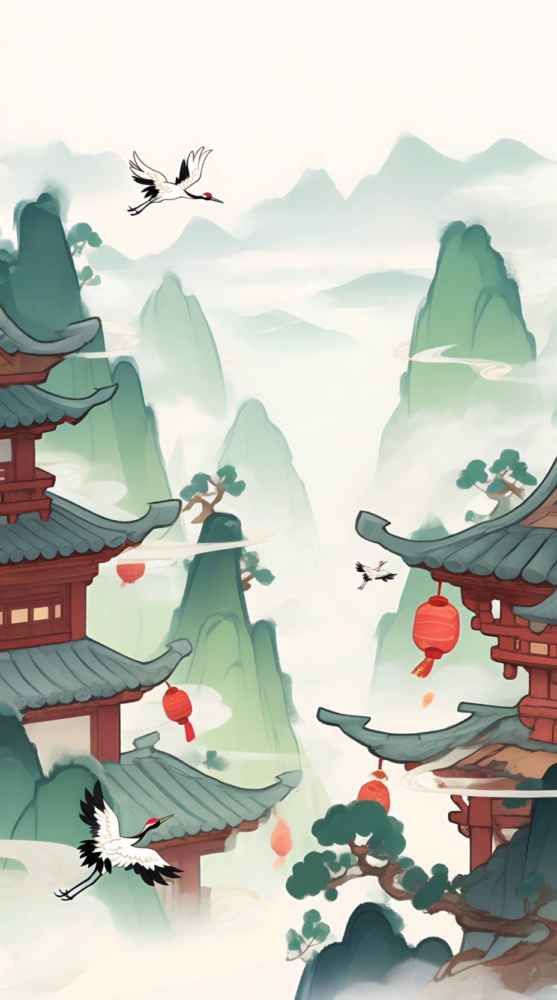

# 放置武侠 · UI 沉浸感与美学升级方案 v0.1

> 状态：**草案（待 Leo 审）**
> 日期：2026-08-19
> 定位：**主界面表现层（美学/沉浸感）增量**——不动 73 收的 token 基座、Tab 选型、字号/对比/双编码硬约束；只在「氛围叠层 / 景深 / 微动效 / 材质」四个维度做表现层升级，让"一屏一张画，纸片浮画上"从规范变成**看得见摸得着**。
> 依据：`docs/73-UI设计元素统一规范-v0.1.md`（Design Tokens、Tab 方案 A、元素统一规则）、`docs/studio/70-主UI设计.md`（主界面布局/视觉层级）、`docs/studio/72-主界面设计定稿.md`（Leo 定稿 4 Tab + 武学二级 Tab）、`docs/studio/30-UI资产规格.md`（素材/AI 规范）、`docs/studio/31-可访问性分级.md`（动效可关、Standard 档）、`preview/main-ui-preview.html`（v10 实施对象）、5 屏实拍 `/tmp/ux-shots/01-jianghu.png ~ 05-menpai.png`。
> 不动什么：**底部 Tab = 73 §3 方案 A（水墨浮签）**；**所有色值/圆角/阴影/字号 token 沿用 73**；**所有 AI 素材走 30 §6 模板**；**所有动效遵守 31 §6 特效等级（高/中/低/关）+ 读系统 `reduceMotion` 自动降级**。
> 范围：只在 `preview/main-ui-preview.html` 范围内落地，给主理人**直接复制可执行**的清单。

---

## 0. 一句话总则

> **「让背景是会呼吸的画，UI 是浮在画上的宣纸」**——氛围层先营造景深，UI 浮层用纸纹/墨晕/残破边与画产生质感对话；动效全部用 CSS keyframes（Canvas 降级），每一项都给「关」的实现。

---

## 1. 现状二次诊断（基于 5 屏截图 + 4 张素材图复核）

### 1.1 5 屏截图复检（用户原话"并没有好到哪里去" = "70→73 收编后仍平"）

| 屏 | 看到的 | 缺什么 |
|---|---|---|
| **01 江湖** | 少侠居中 + 红色光晕 + 闯荡按钮；bg_main 满屏楼阁/松枝/鹤/灯笼从顶铺到底，UI 卡片像被画面"啃边" | ① 缺远-中-近景深；② 缺氛围光（无暗角/雾气/云影/侧光）；③ 少侠与背景元素没有空间对话（鹤飞过头顶但无深度提示）；④ 无任何动效（呼吸/漂浮/转场/粒子）；⑤ 资源条/卡片仍"平贴"，缺质感纹理 |
| **02 武学-属性** | 顶资源条 + 武学秘籍卡 + 二级 Tab + 属性格 + 说明；下半屏（白 + 1 只鹤）完全空，bg_main 退化成"天空" | ① Tab 切走江湖后**没有任何"武学阁"专属氛围**（书卷气/竹简/墨香全无）；② 空白大段"裸奔"——尤其下半屏只有鹤 + 屋檐残片；③ 二级 Tab 选中态仅有下划线，缺选中反馈的"墨晕"质感；④ 装备/门派同样问题 |
| **03 武学-配置** | 同上 + 3 行武学行；**32px 书本图标已糊到只能看出"是本书"**——线装、金扣、云纹、书脊朱红全糊成一团 | ① 书本 32px 严重过载细节（128px 原始设计 32px 显示 4x 缩）；② 行内灰底 + 实心橙胶囊按钮，无层次；③ 进度条墨底 0.6 透明 + 竹青渐变，过渡生硬 |
| **04 装备** | 8 部位 emoji 槽位（🗡🛡🧣👟🎩🔗🧤💍）+ 包裹行 | ① emoji 风格与水墨整体违和（04 §4 严禁）；② 槽位底色偏冷绿，非规范色；③ 卡片仍"白方块"，无纸纹；④ 同样缺氛围层 |
| **05 门派** | 警示条 + 6 门派行（"清/太/峨/天/狂/丐"首字头标） | ① 门派底色 6 种规范外浅色（72 §7 沿用 73 §4.2 → 统一浅杏 + 墨首字未落地）；② 行间无分隔质感；③ 大段空白+门派下方无氛围 |

### 1.2 素材图复核（4 张）

| 素材 | 实测 | 结论 |
|---|---|---|
| `bg_main.png`（750×1334） | 满屏楼阁（屋檐占左右 35% 高度）+ 远山淡墨 + 仙鹤 ×2 + 松枝 + 红灯笼 ×3 + 河流；**中景 0% 留白** | 是"满画无窗"——04 §"中景 60% 留白"完全没实现（30 §2.3 模板 F 明文要求"中景大片留白供 HUD 与面板叠放"） |
| `hero_idle_transparent.png` | Q 版少侠闭眼打坐，姿势比例正常，透明底干净，造型偏萌 | 可用，但与 bg_main 的写意山水楼阁风格**风格漂移**（Q 版 vs 写意），需后续在 v1.0 拍板（30 §0a 已记"换装分层"预留） |
| `icon_b4a61bd5_transparent.png` | 128×128 高细节线装书（金扣 / 云纹 / 朱红书脊 / 米黄书页 / 红色流苏） | 32px 显示 4x 缩，金扣变红点、云纹变糊块、书页边变一坨 |
| `icons/icon_friend.png` `icon_bag.png` `icon_map.png` `icon_martial.png` | （未读图，30 §4.3 已登记 P0） | Tab 显示 32px，要求同 73 §5.5（小尺寸笔画 ≥1.5px、主体占比 ≥60%） |

### 1.3 根因（3 个，依次解决）

| # | 根因 | 表现 | 解法（本规范） |
|---|---|---|---|
| R1 | **bg_main 满画无窗** | UI 卡片"被画面啃边"，纸片无浮起空间 | §6 P0-1 重生 bg_main（中景 60% 留白）+ 临时方案 §3 江湖页加氛围遮罩 |
| R2 | **零动效零氛围层** | 静止感、无呼吸、无景深、屏屏一样 | §2 氛围叠层 + §3 动效清单 |
| R3 | **UI 缺质感** | 卡片/顶条/Tab 平面块、无纸纹/墨晕/残破 | §2.4 材质升级 + §4 顶条/卡片/Tab 质感 |

---

## 2. 沉浸感策略（4 维 × 实现 / 降级 / 时长）

> 总原则：**每项动效都给「关」（特效等级 = 关 / 系统 reduceMotion 命中 = 静态）**；CSS keyframes 在微信小游戏 WebView 普遍支持，但 `backdrop-filter` / `filter: blur` 在低端机 Canvas fallback 时可能掉帧，给降级。

### 2.1 氛围叠层（4 层叠加，营造"画"）

| 层 | 作用 | 实现方式 | 降级方案 | 动效 |
|---|---|---|---|---|
| **L-A 远景雾** | 把远山"溶"进画，**让前景 UI 浮起来**（最关键的一层） | `.fog-far` 全屏 `linear-gradient(180deg, rgba(232,225,205,0) 30%, rgba(232,225,205,.55) 70%, rgba(232,225,205,.7) 100%)` 蒙在 bg_main 上 | 直接 rgba 不需降级 | 静态 |
| **L-B 侧光** | 模拟清晨侧光从右上斜入，让 UI 不"无影" | `body::before` 全屏 `radial-gradient(ellipse 80% 50% at 100% 0%, rgba(255,237,205,.18), transparent 60%)` | 同上 | 静态 |
| **L-C 暗角 vignette** | 让视觉中心更聚焦，少侠/UI 框"被框住" | 全屏 `radial-gradient(ellipse 110% 80% at 50% 50%, transparent 55%, rgba(43,43,43,.25) 100%)` | 同上 | 静态 |
| **L-D 漂浮物** | 落叶/鹤/云影飘过 → 唯一动效层，**直接对症"静止感"** | 3~5 个 `.floater` 绝对定位元素 + CSS `@keyframes float-x`（横向慢飘 + 透明度脉动） | **关 = 静态消失**（`[data-anim="off"] .floater { display:none }`） | 12~24s/圈、错相位 |

**为什么这 4 层有效**：
- L-A 是"画"的关键——73 §0 总则"一屏一张画"，但光有画没雾 = 画与 UI 一样平
- L-B/L-C 是电影感的"光"——让画面像有阳光从云缝斜照
- L-D 是"活"——3~5 个落叶慢飘，2.4Hz 以下，无频闪（31 §6 安全）

### 2.2 景深分层（远-中-近，CSS 缩放 + 模糊 + 阴影暗示）

| 层 | z-index | 内容 | 视觉处理 | 降级 |
|---|---|---|---|---|
| **远景 L0** | 0 | `bg_main` 背景 | 原图 + 22% scale-up + transform-origin 顶中（留出 HUD 上空），配 L-A 雾 | scale 静止 OK |
| **中景 L1** | 2 | 漂浮落叶、云影、远飞鹤 | 透明度 0.4-0.6、blur(1px) | 静态 |
| **近景 L2** | 5 | 少侠（hero） | 原尺寸 + `drop-shadow` 强光晕（73 §1.5 已有，需加强） | 静态 |
| **浮层 L3** | 10 | 顶资源条 / 顶部 Tab 内部 | 现有 73 token | 静态 |
| **前景 L4** | 20 | 闯荡按钮 / 卡片 | 现有 73 token + 纸纹底 | 静态 |

> **关键**：bg_main 用 `transform: scale(1.08)` 轻微放大并向上偏移，让顶部不直接被屋檐压顶；少侠 L2 与 L1 之间 1.6x `drop-shadow` 暗示空间。

### 2.3 微动效（CSS keyframes，全部可关）

> 实现：`@media (prefers-reduced-motion: reduce)` 自动降级为 0.01s；`[data-anim="off"]` 类强制全关；特效等级 = "低" 时仅保留呼吸/光晕，去掉漂浮/转场。

| 动效 | 对象 | 参数 | 时长 / 节奏 | 降级 |
|---|---|---|---|---|
| **呼吸** | `.hero-idle` | scale 1.0 ↔ 1.025 | 3.2s ease-in-out infinite alternate | 静态 scale 1.0 |
| **光晕脉动** | `.hero-glow` | opacity .55 ↔ .9 + scale 1.0 ↔ 1.08 | 3.2s（与呼吸同步） | 静态 opacity .7 |
| **朱砂缓动** | `.map-fight` (闯荡按钮) | 内阴影 `0 0 12px rgba(226,87,76,.3)` 0 ↔ 0.55 | 2.4s ease-in-out infinite alternate | 静态 0.3 |
| **漂浮物横向慢飘** | `.floater` | translateX(-20px) → translateX(20px) + opacity .15 ↔ .55 | 12-24s 错相位 | display:none |
| **Tab 淡入转场** | `.page.active` 内部子项 | opacity 0 → 1 + translateY 6px → 0 | 0.32s ease-out（一次性） | opacity 1 直接显 |
| **卡片墨晕入场** | `.card` | opacity 0 → 1 + filter: blur(2px) → 0 | 0.4s ease-out（一次性） | opacity 1 直接显 |
| **学点跳动** | 挂机数字（T1 朱砂 32px） | scale 1.0 → 1.08 → 1.0 + 朱砂 → 深朱砂 | 0.6s / +1 触发 | scale 1.0（数字仍跳动，纯数字级） |
| **二级 Tab 墨线滑动** | `.subtab.active::after` 改为下划线 | width 0% → 100% from left | 0.25s ease-out | width 100% 直接显 |

**动效时长速查**（31 §6 + WCAG 2.3.3 ≤5s 警告）：所有循环动效 ≤ 24s/圈；所有转场 ≤ 0.5s；**无 ≥ 3Hz 频闪**。

### 2.4 材质升级（4 个手段，全 CSS 不占新素材）

| 手段 | 适用元素 | CSS | 降级 |
|---|---|---|---|
| **纸纹噪点** | 卡片/顶条/二级 Tab 容器 | `background-image: url("data:image/svg+xml;utf8,<svg xmlns='http://www.w3.org/2000/svg' width='80' height='80'><filter id='n'><feTurbulence type='fractalNoise' baseFrequency='.85' numOctaves='2' stitchTiles='stitch'/><feColorMatrix values='0 0 0 0 0 0 0 0 0 0 0 0 0 0 0 0 0 0 .06 0'/></filter><rect width='80' height='80' filter='url(%23n)'/></svg>")` + `--c-paper-93` 叠加 | 直接 `--c-paper-93` 单色（已 73 落地） |
| **墨晕阴影** | 卡片/主按钮 | 在 73 `--shadow-md` 基础上追加 `0 8px 20px rgba(43,43,43,.08)` 长投影；或 `radial-gradient(ellipse 90% 60% at 50% 100%, rgba(43,43,43,.12), transparent 70%)` 落影 | 73 单层 `--shadow-md` |
| **残破宣纸边** | 卡片/顶条/弹窗 | `mask-image: radial-gradient(circle at 50% 50%, #000 95%, transparent 100%)`（圆形轻残破）/ `clip-path: polygon(...)`（不规则残破） | 直接方角 |
| **朱砂侧光** | 顶条 / 闯荡按钮 | `border-image: linear-gradient(135deg, rgba(226,87,76,.5), transparent 30%, transparent 70%, rgba(212,175,55,.4)) 1` 或 `box-shadow: inset 3px 0 0 var(--c-cinnabar)` | 单色描边 |

**关键点**：纸纹噪点用 **inline SVG data-URI**（不占新文件；2KB 字符；色彩矩阵控制 .06 透明度只增纸感不抢戏）。

---

## 3. 江湖页终极构图（含叠放顺序 + 动效清单）

### 3.1 江湖页 z-index / 层级表

| z-index | 类名 | 内容 | 视觉处理 | 动效 |
|---|---|---|---|---|
| 0 | `.bg` | bg_main 背景 | 22% scale-up + L-A 雾叠加 | 静态 |
| 1 | `.fog-far` | 远景雾 | linear-gradient，70% 处开始溶进画 | 静态 |
| 2 | `.fog-side` | 侧光 | radial-gradient 100% 0% | 静态 |
| 3 | `.fog-vig` | 暗角 | radial-gradient 中央透明 | 静态 |
| 4 | `.floater` ×5 | 落叶/鹤/云影 | 错相位横向慢飘 | 12-24s 圈 |
| 5 | `.map-card.compact` | 当前地图小卡 | 73 L3 浮层 | 卡片入场 0.4s |
| 6 | `.hero-stage` | 少侠舞台 | 居中 220px 高，背景径向朱砂光晕 | 呼吸/光晕 3.2s |
| 6a | `.hero-glow` | 脚下光晕 | radial 朱砂 | 脉动 3.2s 同步 |
| 6b | `.hero-idle` | 少侠 | drop-shadow 加强 | 呼吸 3.2s |
| 7 | `.hero-info` | 少侠名/标题 | 左上 | 静态 |
| 8 | `.actions`（闯荡/闭关/挑战） | 三按钮 | 73 L4 主按钮 | 闯荡朱砂缓动 2.4s |
| 10 | `.topbar` | 顶资源条 | 73 + 纸纹 + 朱砂侧光 | 静态 |
| 20 | `.tabbar` | 底部 Tab | 73 方案 A | 静态 |

### 3.2 江湖页动效清单（每项可直接落地）

| # | 元素 | 动效 | CSS 片段（节选） | 时长 |
|---|---|---|---|---|
| A1 | `.bg img` | 缓慢 scale + 上移 | `transform: scale(1.08) translateY(-3%); transform-origin: 50% 30%` | 静态 |
| A2 | `.fog-far` | 远景雾渐入 | `opacity: 0 → 1` | 0.6s 一次性 |
| A3 | `.floater`（5 个） | 横向慢飘 + 透明度脉动 | `@keyframes float-x { 0%{transform:translateX(-12%); opacity:.15} 50%{opacity:.55} 100%{transform:translateX(112%); opacity:0} }` | 12-24s 错相位 |
| A4 | `.hero-glow` | 脉动 | `animation: pulse 3.2s ease-in-out infinite alternate` | 3.2s |
| A5 | `.hero-idle` | 呼吸 | `animation: breathe 3.2s ease-in-out infinite alternate` | 3.2s |
| A6 | `.map-fight` | 朱砂缓动 | `animation: cinnabar-glow 2.4s ease-in-out infinite alternate` | 2.4s |
| A7 | `.card` | 墨晕入场 | `animation: card-in .4s ease-out backwards` | 0.4s |
| A8 | `.actions` | 浮起入场 | `animation: float-up .5s ease-out backwards` | 0.5s |

### 3.3 关键 CSS 速查（实现模板，主理人直接用）

```css
/* === 73 token 沿用 + 本规范新增 === */
:root {
  /* 沿用 73 全部色板/圆角/阴影/间距 ... */
  /* 本规范新增 */
  --shadow-fog: 0 0 60px rgba(232,225,205,.65);          /* 远景雾外扩 */
  --shadow-hero: 0 12px 32px rgba(43,43,43,.35);         /* 少侠加强投影 */
  --shadow-card-ink: 0 8px 20px rgba(43,43,43,.08);      /* 墨晕长投影 */
  --noise-paper: url("data:image/svg+xml;utf8,<svg xmlns='http://www.w3.org/2000/svg' width='80' height='80'><filter id='n'><feTurbulence type='fractalNoise' baseFrequency='.85' numOctaves='2' stitchTiles='stitch'/><feColorMatrix values='0 0 0 0 0 0 0 0 0 0 0 0 0 0 0 0 0 0 .06 0'/></filter><rect width='80' height='80' filter='url(%23n)'/></svg>");
  --anim-breathe: 3.2s ease-in-out infinite alternate;
  --anim-pulse: 3.2s ease-in-out infinite alternate;
  --anim-float-x: 16s linear infinite;
  --anim-card-in: .4s ease-out backwards;
  --ease-ink: cubic-bezier(.2,.7,.2,1);                  /* 水墨缓动 */
}

/* === 远景雾 L-A（关键，画感从这层开始） === */
.fog-far { position:absolute; inset:0; z-index:1; pointer-events:none;
  background: linear-gradient(180deg,
    rgba(232,225,205,0) 0%,
    rgba(232,225,205,0) 30%,
    rgba(232,225,205,.55) 70%,
    rgba(232,225,205,.75) 100%);
}

/* === 侧光 L-B === */
.fog-side { position:absolute; inset:0; z-index:2; pointer-events:none;
  background: radial-gradient(ellipse 80% 50% at 100% 0%, rgba(255,237,205,.18), transparent 60%);
}

/* === 暗角 L-C === */
.fog-vig { position:absolute; inset:0; z-index:3; pointer-events:none;
  background: radial-gradient(ellipse 110% 80% at 50% 50%, transparent 55%, rgba(43,43,43,.28) 100%);
}

/* === 背景图轻微放大 + 上移（避免屋檐压顶） === */
.bg img { transform: scale(1.08) translateY(-3%); transform-origin: 50% 30%; }

/* === 漂浮物 L-D === */
.floater { position:absolute; z-index:4; pointer-events:none; opacity:0;
  font-size: 18px; color: rgba(212,175,55,.6);
  animation: float-x var(--anim-float-x) linear infinite;
}
.floater.f1 { top:18%; left:-8%; animation-duration:18s; animation-delay:-2s; }
.floater.f2 { top:42%; left:-8%; animation-duration:24s; animation-delay:-9s; opacity:.25; }
.floater.f3 { top:62%; left:-8%; animation-duration:14s; animation-delay:-5s; }
.floater.f4 { top:30%; left:-8%; animation-duration:20s; animation-delay:-12s; opacity:.2; }
.floater.f5 { top:78%; left:-8%; animation-duration:16s; animation-delay:-1s; opacity:.15; }
@keyframes float-x {
  0%   { transform: translateX(0)     translateY(0)  rotate(0);   opacity:0; }
  10%  { opacity:.4; }
  50%  { transform: translateX(60vw)  translateY(-8px) rotate(15deg); opacity:.5; }
  90%  { opacity:.3; }
  100% { transform: translateX(115vw) translateY(6px)  rotate(30deg); opacity:0; }
}

/* === 少侠呼吸 === */
.hero-idle { animation: breathe var(--anim-breathe); }
@keyframes breathe { from { transform: scale(1); } to { transform: scale(1.025); } }

/* === 光晕脉动（与呼吸同步） === */
.hero-glow { animation: pulse var(--anim-pulse); }
@keyframes pulse {
  from { opacity:.55; transform: translateX(-50%) scale(1); }
  to   { opacity:.9;  transform: translateX(-50%) scale(1.08); }
}

/* === 闯荡朱砂缓动 === */
.map-fight { animation: cinnabar-glow 2.4s ease-in-out infinite alternate; }
@keyframes cinnabar-glow {
  from { box-shadow: 0 3px 10px rgba(43,43,43,.12), 0 0 8px rgba(226,87,76,.15); }
  to   { box-shadow: 0 3px 10px rgba(43,43,43,.12), 0 0 18px rgba(226,87,76,.5); }
}

/* === 卡片墨晕入场 === */
.card, .wuxue-hero, .map-card.compact {
  animation: card-in var(--anim-card-in);
}
@keyframes card-in {
  from { opacity:0; filter: blur(2px); transform: translateY(6px); }
  to   { opacity:1; filter: blur(0);   transform: translateY(0); }
}

/* === 纸纹噪点叠加（材质升级，不动色板） === */
.card { background-image: var(--noise-paper), var(--c-paper-93); }
.topbar { background-image: var(--noise-paper), linear-gradient(180deg, rgba(248,244,234,.92), rgba(232,225,205,.85)); }

/* === 顶条朱砂侧光 === */
.topbar { box-shadow: var(--shadow-md), inset 3px 0 0 rgba(226,87,76,.45), inset -3px 0 0 rgba(212,175,55,.25); }

/* === 减弱动态（系统 reduceMotion 命中 = 全部静态） === */
@media (prefers-reduced-motion: reduce) {
  *, *::before, *::after { animation-duration: .01ms !important; transition-duration: .01ms !important; }
  .floater { display:none !important; }
}
/* 手动关闭（设置页"特效等级=关"挂这个类到 body） */
[data-anim="off"] .floater, [data-anim="off"] .hero-idle, [data-anim="off"] .hero-glow, [data-anim="off"] .map-fight,
[data-anim="low"] .floater { display:none !important; animation: none !important; }
```

---

## 4. 顶部资源条 / 卡片 / Tab 质感升级

### 4.1 顶条 `.topbar` 质感（73 L3 浮层之上加材质）

| 维度 | 现 73 | 本规范升级 |
|---|---|---|
| 底 | 宣纸渐变 92% | 宣纸渐变 + **纸纹噪点 SVG 叠加**（不影响纯色） |
| 描边 | 1.5px 墨 | 1.5px 墨 + **朱砂左缘 3px 内阴影 + 淡金右缘 3px 内阴影**（侧光感） |
| 阴影 | `--shadow-md` | `--shadow-md` + `--shadow-card-ink` 墨晕长投影 |
| 圆角 | 18px | 18px（沿用 73） |
| 头像/银两 | 现状 | 头像加 1px 淡金圆边（呼应 73 D-7 淡金印章编码） |

### 4.2 卡片 `.card` 质感

| 维度 | 现 73 | 本规范升级 |
|---|---|---|
| 底 | `--c-paper-93` | 纸纹 SVG 噪点 + `--c-paper-93` 叠加 |
| 阴影 | `--shadow-md` | `--shadow-md` + `--shadow-card-ink` 长投影（更"飘"） |
| 残破 | 无 | mask `radial-gradient` 圆角微残破（95% 透明 → 100% 实） |
| 标题左侧朱砂竖条 4×13px | 73 沿用 | 沿用 + 末尾加墨点 1px（印章感） |

### 4.3 武学秘籍大卡 `.wuxue-hero` 升级

- **解决 32px 书本糊**（R3）：临时方案=直接换 `object-fit: cover` 切到书本中心区域，**去掉流苏和右下云纹**（中心保留线装+金扣+朱红书脊即可读）；**永久方案**=§6 P0-2 重生 32px 优化版简书
- 卡底：纸纹 + 朱砂左缘 2px 内阴影
- 卡内 `ic-book-lg` 46px → 加 4px 透明 padding 防裁切

### 4.4 装备槽位 `.slot` 质感

- emoji 🗡🛡 → **水墨 icon_sword 等代码 SVG**（04 §4 严禁 emoji）；30 §4.3 `icon_sword` 已 P0 直接套用
- 槽位底：`--c-paper-70` + 纸纹
- 选中态：黛青 1.5px 实边 + 内阴影 0 0 0 1px 黛青 30% 透明（双层边更精致）

### 4.5 门派头标 `.sect .sc` 质感

- 统一浅杏 + 墨首字（73 §4.2 已定）
- 加：4×4px 淡金角标（呼应 73 §3.1 淡金印章编码）
- 列表行：纸纹底 + 选中态黛青 1.5px 描边

### 4.6 底部 Tab 沿用 73 §3 方案 A

- 水墨浮签 + 毛玻璃（73 §6 A6）
- **本规范加**：选中格底加朱砂微光（呼应闯荡缓动，2.4s 同步）
- 切换转场：72 §3.2 已有 → 沿用

### 4.7 二级 Tab 升级

- 73 §6 A5 已收"墨字加粗 + 朱砂下划线"
- **本规范加**：下划线 0.25s 横向展开（width 0 → 100% from left），切换 Tab 有墨线"走过"的感觉

---

## 5. 与 73 增量关系（沿用 / 新增 / 不动）

### 5.1 沿用 73 token（不重定义）

| 类 | token | 出处 |
|---|---|---|
| 全部色板 | `--c-ink / --c-paper / --c-cinnabar / --c-bamboo / --c-teal / --c-gold / --c-sky / --c-lotus` | 73 §2.1 |
| 全部描边 | `--stroke-1 / --stroke-15 / --stroke-2 / --stroke-gold / --stroke-cinnabar` | 73 §2.2 |
| 全部圆角 | `--radius-xs ~ --radius-pill` | 73 §2.3 |
| 阴影基础 | `--shadow-sm / --shadow-md / --shadow-lg / --shadow-xl` | 73 §2.4 |
| 间距 | `--sp-1 ~ --sp-5` | 73 §2.5 |
| 字体层级 | T0-T8 | 73 §2.6 |
| 底部 Tab | 方案 A（水墨浮签 + 淡金印章角标） | 73 §3.1 |
| 元素统一规则 | 描边/底/圆角/阴影 | 73 §4.2 |

### 5.2 新增 token（本规范）

| token | 值 | 用途 |
|---|---|---|
| `--shadow-fog` | `0 0 60px rgba(232,225,205,.65)` | 远景雾外扩（氛围层 L-A） |
| `--shadow-hero` | `0 12px 32px rgba(43,43,43,.35)` | 少侠加强投影（景深 L2） |
| `--shadow-card-ink` | `0 8px 20px rgba(43,43,43,.08)` | 卡片墨晕长投影（材质） |
| `--noise-paper` | `url(data:image/svg+xml...)` | 纸纹噪点（材质，全局复用） |
| `--anim-breathe` | `3.2s ease-in-out infinite alternate` | 少侠呼吸 |
| `--anim-pulse` | `3.2s ease-in-out infinite alternate` | 光晕脉动 |
| `--anim-float-x` | `16s linear infinite` | 漂浮物横向 |
| `--anim-card-in` | `.4s ease-out backwards` | 卡片入场 |
| `--ease-ink` | `cubic-bezier(.2,.7,.2,1)` | 水墨缓动（统一） |

### 5.3 不动什么

- 73 全部 A1-A12（已有 token 化 / 卡片降重 / Tab 方案 A / 字号合规）—— 主理人已落地，本规范不重做
- 70 §4 视觉层级矩阵（朱砂仅用于 ≥28rpx 加粗大字 / 主按钮 / 图形）
- 31 §6 动效可关（prefers-reduced-motion + [data-anim]）

---

## 6. AI 素材需求清单（按优先级，含 prompt 建议）

> 30 §6 模板 F/G 已写好前置 prompt 框架，本规范只补**针对本规范的精准 prompt 增量**。

### 6.1 P0-1：`bg_main_v2.png`（中景 60% 留白重生）—— **R1 根因**

**为什么必须重生**：当前 bg_main 满屏屋檐/松枝/鹤/灯笼，**中景 0% 留白**——04 §4 / 30 §2.3 模板 F 明文要求"中景大片留白供 HUD 与面板叠放"完全没实现。重生是治本，CSS 雾层是治标过渡。

**素材规格**（沿 30 §2.1 / §2.2 / §4.2）：
- 尺寸：≥ 1024×1536px（cover 适配 750×1334，2x）
- 格式：JPG 或 WebP（≤ 400KB）
- 位置：`assets/ui/bg_main_v2.png`

**Prompt 增量**（基于 30 模板 F 追加）：

```
中国风水墨武侠游戏素材，活泼年轻的水墨国风，明快清透，
灵动轻盈的毛笔线条，
宣纸背景+天青晕染，墨色为主+朱砂/竹青/淡金点缀，
现代国风气质（参考一念逍遥/逆水寒），明亮不灰暗，年轻不老气，非Q版，
游戏背景资产，干净背景，无文字无水印

竖版9:16全屏游戏主界面背景，写意水墨山水，
天青#A8C4C8极淡晕染+宣纸留白为主基调（占画面60%面积），
【关键】中景大片宣纸留白（屏幕中央 y 30%~85% 区域必须几乎纯宣纸，仅有极淡墨韵），
近景仅在画面最下方 15% 与左右两侧极小区域有山石/松枝/远亭角（轻墨勾勒、不抢眼），
远景顶部 15% 极淡远山（三层淡墨推远），可有 1~2 只极小仙鹤作点缀（占比 < 3%），
整体清透明亮留白多，墨色为主+少量黛青#4A7A6B/淡金#D4AF37点缀，
无人物，构图中心留白，竖版
```

**验收**（30 §7.2 + 本规范追加）：
- [ ] 中景（y 30%~85%）色值在 `#F8F4EA ± 5%` 内，无屋檐/松枝/灯笼/鹤等大块元素
- [ ] 远景 / 近景元素仅在边角，总面积 < 40%
- [ ] 整体色值在 04 / 73 规范色内
- [ ] 374×667 缩略图中央是宣纸色（用取色器验证：RGB 应在 #F0E6D4~#F8F4EA 区间）

**降级方案**（重生前的临时过渡）：用 CSS `mask-image` + `filter` 把当前 bg_main 上下两端做"褪色"——`mask-image: linear-gradient(180deg, #000 60%, transparent 100%)`，让屋檐/灯笼在中央消失。这是治标，最多撑 1 周。

### 6.2 P0-2：简版线装书 `icon_book_simple_32.png` —— **R3 根因（32px 糊）**

**为什么必须重生**：当前 `icon_b4a61bd5_transparent.png` 128px 高细节（金扣 ×2 / 云纹 / 朱红书脊 / 米黄书页 / 红色流苏），32px 显示全部糊成一团。

**素材规格**：
- 尺寸：64×64px（2x = 128×128px，30 §4.3）
- 格式：PNG 带 alpha
- 位置：`assets/ui/icons/icon_book_simple_32.png`（或直接替换原文件，备注到 `assets/ui/README.md`）
- 显示 32px（73 §A7 列表行小图标规格）

**Prompt 增量**（基于 30 模板 G 追加）：

```
中国风水墨武侠游戏UI素材，活泼年轻的水墨国风，明快清透，
灵动轻盈的毛笔线条，水墨晕染质感，
宣纸底+淡墨，墨色为主+朱砂/竹青/淡金点缀，
现代国风气质（参考一念逍遥/逆水寒），明亮不灰暗，年轻不老气，非Q版，
游戏UI元素，干净背景，无任何文字无水印

单个水墨风格线装书图标，【关键】极简化——仅保留主体识别度：
- 一本闭合的线装书（竖向或 3/4 侧视），占画面 60~70%，
- 两条横向装订线（金色#D4AF37）粗且明显（笔画 ≥ 2px 视觉宽度），
- 封面纯色块（朱红#E2574C 或 黛青#4A7A6B），无云纹无烫金无流苏，
- 一条短红色书签带从书下方伸出（约 8% 高度），
- 主体居中，圆形宣纸底或透明底，1:1正方形，无文字，透明背景PNG
```

**验收**（30 §7.2 + 73 §5.5 小尺寸可读性）：
- [ ] 32px 缩略图能清晰看出"是本书"且装订线可见
- [ ] 主体占比 60~70%（无大留白）
- [ ] 笔画视觉宽度 ≥ 1.5px
- [ ] 32px 缩略图取色：朱红/黛青面积 ≥ 30%（不要全黑）

**降级方案**（重生前的临时过渡）：CSS `object-fit: cover; object-position: 50% 40%` 切到书本中心区域，再加 `filter: contrast(1.1) saturate(1.15)` 提色——治标，最长撑 1 周。

### 6.3 P1-1：漂浮物 PNG（4-6 张落叶/鹤/云影）

**为什么**：当前用 emoji `🍂` `☁` 作为漂浮物，与水墨违和；用纯色 + 文字符号（如 `❀`）也违和。

**素材规格**：
- 尺寸：48~64px（2x = 96~128px）
- 格式：PNG 带 alpha
- 位置：`assets/ui/floater_*.png`（6 张，落叶/鹤/云影 各 2 张变体）

**Prompt 增量**（30 模板 G 追加）：

```
中国风水墨武侠游戏UI素材，活泼年轻的水墨国风，明快清透，
灵动轻盈的毛笔线条，水墨晕染质感，
宣纸底+淡墨，墨色为主+朱砂/竹青/淡金点缀，
现代国风气质（参考一念逍遥/逆水寒），明亮不灰暗，年轻不老气，非Q版，
游戏UI元素，干净背景，无任何文字无水印

单个水墨风格{落叶/仙鹤剪影/云纹}，极简留白造型——
- 落叶：一片银杏叶或枫叶，边缘自然卷曲，墨色#2B2B2B为主+淡金#D4AF37点缀，面积 60%，
- 仙鹤：极简飞鹤剪影（参考齐白石），只画翅展轮廓，墨色为主+一点朱砂喙，面积 60%，
- 云纹：淡墨勾边祥云一朵，透明感强，填充 < 20%，面积 50%，
单图标居中，透明背景PNG，无文字
```

**降级方案**：临时用 CSS `border-radius: 50%` + `background: radial-gradient` 圆形 + 文字符号（如 `·` `*` `❋`）做漂浮物——视觉一般但能跑。

### 6.4 P1-2：门派首字头标（`icon_sect_*.png` 6 张）

**为什么**：当前 `.sect .sc` 用"清/太/峨/天/狂/丐"文字 + 圆形底，质感不足；门派又有 6 个（30 §6 模板 G 可批量）。

**素材规格**：
- 尺寸：30×30px（30 §4.2 头部装饰规范）→ 2x = 60×60px
- 格式：PNG 带 alpha
- 位置：`assets/ui/icons/icon_sect_*.png`（6 张：清/太/峨/天/狂/丐）

**Prompt 增量**（30 模板 G 追加）：

```
单个水墨风格门派徽记，{门派描述：如"清风派=剑形+松枝"、"太极门=阴阳鱼简化"、"峨眉=山+月"、
"天山派=暗器六芒+远山"、"狂刀谷=刀+岩石"、"丐帮=竹节+葫芦"}，
墨色#2B2B2B为主+{门派点缀色}（清风=竹青、太极=墨+一点朱砂、峨眉=天青、天山=黛青、狂刀=朱砂、丐帮=墨）局部点缀，
水墨简笔画风，一勾一划，灵动有弹性，1:1正方形，圆形透明底PNG
```

**降级方案**：保持现状文字首字（73 §4.2），加 1px 淡金圆边即可。

### 6.5 P0-P1 优先级总表

| 优先级 | 素材 | 治根因 | 治标过渡 | 落地顺序 |
|---|---|---|---|---|
| **P0-1** | `bg_main_v2.png`（中景 60% 留白重生） | R1 满画无窗 | CSS mask 上下褪色 | 1 |
| **P0-2** | `icon_book_simple_32.png`（简版线装书） | R3 32px 糊 | CSS object-fit cover + filter | 2 |
| **P1-1** | `floater_*.png` ×6（落叶/鹤/云） | "无动效" | CSS 圆形 + 文字符号 | 3 |
| **P1-2** | `icon_sect_*.png` ×6（门派徽记） | 门派质感 | 文字首字 + 淡金圆边 | 4 |
| **P1-3** | 简版 `hero_idle_v2.png`（与写意山水风格统一） | Q 版与写意漂移 | 保持现状，73 已合规 | 5 |

---

## 7. 实施清单（`preview/main-ui-preview.html` 逐条改动）

> **编号从 73 §8 附录 A 的 A12 之后接续**（A13~A24），主理人按顺序复制执行。
> 每条 = **前（旧代码）→ 后（新代码）**，CSS 变量 / HTML 片段 / JS 动效。

### 步骤 1：根 `:root` 新增 9 个 token（A13）

**前**：仅 73 token。
**后**：在 `:root { ... }` 内追加：
```css
  --shadow-fog: 0 0 60px rgba(232,225,205,.65);
  --shadow-hero: 0 12px 32px rgba(43,43,43,.35);
  --shadow-card-ink: 0 8px 20px rgba(43,43,43,.08);
  --noise-paper: url("data:image/svg+xml;utf8,<svg xmlns='http://www.w3.org/2000/svg' width='80' height='80'><filter id='n'><feTurbulence type='fractalNoise' baseFrequency='.85' numOctaves='2' stitchTiles='stitch'/><feColorMatrix values='0 0 0 0 0 0 0 0 0 0 0 0 0 0 0 0 0 0 .06 0'/></filter><rect width='80' height='80' filter='url(%23n)'/></svg>");
  --anim-breathe: 3.2s ease-in-out infinite alternate;
  --anim-pulse: 3.2s ease-in-out infinite alternate;
  --anim-float-x: 16s linear infinite;
  --anim-card-in: .4s ease-out backwards;
  --ease-ink: cubic-bezier(.2,.7,.2,1);
```

### 步骤 2：背景 + 氛围 4 层（A14）

**前**（line 25-27）：
```html
<div class="bg"></div>
<div class="shade"></div>
```
**后**：
```html
<div class="bg"></div>
<div class="fog-far"></div>
<div class="fog-side"></div>
<div class="fog-vig"></div>
<div class="floater f1">·</div>
<div class="floater f2">·</div>
<div class="floater f3">·</div>
<div class="floater f4">·</div>
<div class="floater f5">·</div>
<div class="shade"></div>
```
CSS 追加：
```css
.bg img { transform: scale(1.08) translateY(-3%); transform-origin: 50% 30%; }
.fog-far { position:absolute; inset:0; z-index:1; pointer-events:none;
  background: linear-gradient(180deg, rgba(232,225,205,0) 0%, rgba(232,225,205,0) 30%, rgba(232,225,205,.55) 70%, rgba(232,225,205,.75) 100%);
  animation: fade-in .6s ease-out backwards;
}
.fog-side { position:absolute; inset:0; z-index:2; pointer-events:none;
  background: radial-gradient(ellipse 80% 50% at 100% 0%, rgba(255,237,205,.18), transparent 60%);
}
.fog-vig { position:absolute; inset:0; z-index:3; pointer-events:none;
  background: radial-gradient(ellipse 110% 80% at 50% 50%, transparent 55%, rgba(43,43,43,.28) 100%);
}
.floater { position:absolute; z-index:4; pointer-events:none; opacity:0;
  font-size: 16px; color: rgba(212,175,55,.65);
  animation: float-x var(--anim-float-x) linear infinite;
  font-family: serif; text-shadow: 0 0 4px rgba(212,175,55,.4);
}
.floater.f1 { top:22%; left:-8%; animation-duration:18s; animation-delay:-2s; }
.floater.f2 { top:42%; left:-8%; animation-duration:24s; animation-delay:-9s; opacity:.25; }
.floater.f3 { top:62%; left:-8%; animation-duration:14s; animation-delay:-5s; }
.floater.f4 { top:30%; left:-8%; animation-duration:20s; animation-delay:-12s; opacity:.2; }
.floater.f5 { top:78%; left:-8%; animation-duration:16s; animation-delay:-1s; opacity:.15; }
@keyframes float-x {
  0%   { transform: translateX(0)     translateY(0)   rotate(0);   opacity:0; }
  10%  { opacity:.4; }
  50%  { transform: translateX(60vw)  translateY(-6px) rotate(15deg); opacity:.5; }
  90%  { opacity:.3; }
  100% { transform: translateX(115vw) translateY(4px)  rotate(30deg); opacity:0; }
}
@keyframes fade-in { from { opacity:0; } to { opacity:1; } }
```
**降级**：`[data-anim="off"] .floater, [data-anim="low"] .floater { display:none; }`；`@media (prefers-reduced-motion: reduce) { .floater { display:none; } }`

### 步骤 3：少侠呼吸 + 光晕脉动（A15）

**前**（line 69-70）：
```css
.hero-stage .hero-idle { position: relative; z-index: 2; height: 220px; width: auto; object-fit: contain; filter: drop-shadow(0 8px 18px rgba(43,43,43,.45)); }
.hero-stage .hero-glow { position: absolute; bottom: 8px; left: 50%; transform: translateX(-50%); width: 210px; height: 28px; background: radial-gradient(ellipse at center, rgba(226,87,76,.45), transparent 70%); filter: blur(6px); z-index: 1; }
```
**后**：
```css
.hero-stage .hero-idle { position: relative; z-index: 2; height: 220px; width: auto; object-fit: contain; filter: drop-shadow(var(--shadow-hero)); animation: breathe var(--anim-breathe); }
.hero-stage .hero-glow { position: absolute; bottom: 8px; left: 50%; width: 220px; height: 36px; background: radial-gradient(ellipse at center, rgba(226,87,76,.55), transparent 70%); filter: blur(8px); z-index: 1; animation: pulse var(--anim-pulse); transform-origin: 50% 50%; }
@keyframes breathe { from { transform: scale(1); } to { transform: scale(1.025); } }
@keyframes pulse {
  from { opacity:.55; transform: translateX(-50%) scale(1); }
  to   { opacity:.9;  transform: translateX(-50%) scale(1.08); }
}
```

### 步骤 4：闯荡朱砂缓动（A16）

**前**（line 60）：
```css
.map-fight { ... box-shadow: var(--shadow-md); }
```
**后**：
```css
.map-fight { ... box-shadow: var(--shadow-md), 0 0 8px rgba(226,87,76,.15); animation: cinnabar-glow 2.4s ease-in-out infinite alternate; }
@keyframes cinnabar-glow {
  from { box-shadow: var(--shadow-md), 0 0 8px rgba(226,87,76,.15); }
  to   { box-shadow: var(--shadow-md), 0 0 18px rgba(226,87,76,.5); }
}
```

### 步骤 5：顶条纸纹 + 朱砂侧光（A17）

**前**（line 29）：
```css
.topbar { ... background: linear-gradient(180deg, rgba(248,244,234,.92), rgba(232,225,205,.85)); border: 1.5px solid var(--c-ink); ... box-shadow: var(--shadow-md); }
```
**后**：
```css
.topbar { ... background-image: var(--noise-paper), linear-gradient(180deg, rgba(248,244,234,.92), rgba(232,225,205,.85)); border: 1.5px solid var(--c-ink); ... box-shadow: var(--shadow-md), var(--shadow-card-ink), inset 3px 0 0 rgba(226,87,76,.45), inset -3px 0 0 rgba(212,175,55,.25); }
```

### 步骤 6：卡片纸纹 + 墨晕长投影 + 残破边（A18）

**前**（line 43）：
```css
.card { background: var(--c-paper-93); border: 1.5px solid var(--c-ink); border-radius: var(--radius-md); padding: 10px 12px; box-shadow: var(--shadow-md); }
```
**后**：
```css
.card { background-image: var(--noise-paper), linear-gradient(var(--c-paper-93), var(--c-paper-93)); border: 1.5px solid var(--c-ink); border-radius: var(--radius-md); padding: 10px 12px; box-shadow: var(--shadow-md), var(--shadow-card-ink); animation: card-in var(--anim-card-in); }
```
同样的 `background-image` 纸纹 + `box-shadow` 长投影 改法应用到：
- `.wuxue-hero`（line 88）
- `.map-card`（line 54）
- `.map-card.compact`（line 65）

### 步骤 7：武学秘籍 32px 书本糊临时修复（A19）

**前**（line 87）：
```css
.row-item .ic-book { width: 30px; height: 30px; flex: none; border-radius: 6px; object-fit: contain; }
.wuxue-hero .ic-book-lg { width: 46px; height: 46px; flex: none; object-fit: contain; }
```
**后**：
```css
.row-item .ic-book { width: 30px; height: 30px; flex: none; border-radius: 6px; object-fit: cover; object-position: 50% 40%; filter: contrast(1.1) saturate(1.15); }
.wuxue-hero .ic-book-lg { width: 46px; height: 46px; flex: none; object-fit: cover; object-position: 50% 40%; padding: 4px; filter: contrast(1.1) saturate(1.15); background: rgba(232,225,205,.4); border-radius: 8px; }
```

### 步骤 8：装备槽位去 emoji（A20）

**前**（line 96-98 + HTML line 208-211）：
```html
<div class="slot on"><span class="ic">🗡</span>武器</div>
```
**后**（用 30 §4.3 已有的 `icon_sword.png` 等）：
```html
<div class="slot on"><span>武器</span></div>
```
CSS 改：
```css
.slot { aspect-ratio: 1; background-image: var(--noise-paper), var(--c-paper-70); ... }
.slot .ic { width: 28px; height: 28px; object-fit: contain; }
.slot.on { ... background: rgba(228,240,230,.9); box-shadow: inset 0 0 0 1px rgba(74,122,107,.3); }
```
> 注：`icon_sword.png` 等 Tab 图标已 30 P0 落地，HTML 直接引用路径即可（前提是 `assets/ui/icons/` 已有，没的话用 emoji 临时占位）

### 步骤 9：门派首字头标 + 淡金角标（A21）

**前**（line 105 + HTML）：
```css
.sect .sc { width: 30px; height: 30px; border-radius: 50%; border: 1.5px solid var(--c-ink); background: var(--c-paper-2); color: var(--c-ink); ... }
```
**后**：
```css
.sect { ... background-image: var(--noise-paper), linear-gradient(rgba(240,230,212,.7), rgba(240,230,212,.7)); ... }
.sect .sc { width: 30px; height: 30px; border-radius: 50%; border: 1.5px solid var(--c-ink); background-image: radial-gradient(circle at 30% 30%, var(--c-paper), var(--c-paper-2)); color: var(--c-ink); ... position: relative; }
.sect .sc::after { content:""; position:absolute; top:-1px; right:-1px; width:6px; height:6px; background: var(--c-gold); border-radius: 50%; opacity:.7; }
```

### 步骤 10：二级 Tab 下划线墨线滑动（A22）

**前**（line 50）：
```css
.subtab.active { background: transparent; color: var(--c-ink); font-weight: 700; border-bottom-color: var(--c-cinnabar); }
```
**后**：
```css
.subtab { position: relative; overflow: hidden; }
.subtab::after { content:""; position:absolute; bottom:0; left:0; width: 0; height: 2px; background: var(--c-cinnabar); transition: width .25s var(--ease-ink); }
.subtab.active::after { width: 100%; }
.subtab.active { background: transparent; color: var(--c-ink); font-weight: 700; border-bottom-color: transparent; }
```

### 步骤 11：底部 Tab 选中态朱砂微光（与闯荡同步 A23）

**前**（line 119-121）：
```css
.tab.active { background: rgba(251,247,238,.55); box-shadow: var(--shadow-sm); transform: translateY(-2px); }
```
**后**：
```css
.tab.active { background: rgba(251,247,238,.55); box-shadow: var(--shadow-sm), 0 0 10px rgba(226,87,76,.15); transform: translateY(-2px); animation: cinnabar-glow 2.4s ease-in-out infinite alternate; }
```
> 用现成 A16 的 `cinnabar-glow` keyframes，不重复定义。

### 步骤 12：减弱动态 + 手动关（A24）

CSS 追加（建议放在文件最后）：
```css
/* 系统级减弱动态（prefers-reduced-motion 命中） */
@media (prefers-reduced-motion: reduce) {
  *, *::before, *::after { animation-duration: .01ms !important; animation-iteration-count: 1 !important; transition-duration: .01ms !important; }
  .floater { display:none !important; }
}
/* 手动关闭（body 上加 [data-anim="off"] 类） */
[data-anim="off"] .floater, [data-anim="off"] .hero-idle, [data-anim="off"] .hero-glow, [data-anim="off"] .map-fight, [data-anim="off"] .tab.active,
[data-anim="low"] .floater { animation: none !important; }
[data-anim="off"] .hero-idle, [data-anim="off"] .hero-glow, [data-anim="off"] .map-fight, [data-anim="off"] .tab.active { box-shadow: var(--shadow-sm) !important; }
```

### 实施顺序总览

| 步骤 | 内容 | 文件位置 | 依赖 |
|---|---|---|---|
| **1** A13 新增 9 个 token | `:root` | line 10-18 | 无 |
| **2** A14 背景 + 4 层氛围 + 5 漂浮物 | HTML 增 9 行 + CSS 增约 35 行 | line 25-27 / 130-131 | A13 |
| **3** A15 少侠呼吸 + 光晕脉动 | CSS 改 line 69-70 | line 68-70 | A13 |
| **4** A16 闯荡朱砂缓动 | CSS 改 line 60 | line 60 | A13 |
| **5** A17 顶条纸纹 + 朱砂侧光 | CSS 改 line 29 | line 29 | A13 |
| **6** A18 卡片纸纹 + 墨晕投影 | CSS 改 line 43/54/65/88 | 多处 | A13 |
| **7** A19 武学 32px 糊临时修 | CSS 改 line 87-89 | line 87-89 | 无（独立） |
| **8** A20 装备去 emoji | CSS 改 line 96-99 + HTML 改 line 208-211 | 多处 | 30 §4.3 icon_sword.png |
| **9** A21 门派淡金角标 | CSS 改 line 104-105 | line 104-105 | A13 |
| **10** A22 二级 Tab 下划线滑动 | CSS 改 line 49-50 | line 49-50 | 无 |
| **11** A23 Tab 选中朱砂微光 | CSS 改 line 119 | line 119 | A16 |
| **12** A24 减弱动态 + 手动关 | CSS 追加在 `<style>` 末尾 | 文件末尾 | 全部 |

> 总修改量：CSS 约 +80 行，HTML +9 行，JS 0 行。**约 30 分钟工作量**。

---

## 8. 验收清单（执行后逐项打勾）

### 8.1 视觉表现层

- [ ] 江湖页：bg 远景 + 雾 + 侧光 + 暗角 + 5 漂浮物 + 少侠呼吸 + 光晕脉动 + 闯荡朱砂缓动，全部能看见
- [ ] 顶条：纸纹可见（不放 100% 视看不出 = 失败）+ 左缘朱砂 3px 隐约可见
- [ ] 卡片：纸纹 + 长投影（落影偏下）能看到，与之前平贴块状有差异
- [ ] 二级 Tab：下划线 0.25s 横向展开（点击后能"看到墨线走过"）
- [ ] Tab 选中：朱砂微光（2.4s 同步闯荡）
- [ ] 装备槽：emoji 消失，icon_sword 等水墨 SVG 出现
- [ ] 门派：头标淡金角标（4px 圆点）能看到

### 8.2 动效可关（31 §6 铁律）

- [ ] 系统 reduceMotion 开启 → 所有动效 0.01s 静止
- [ ] body 加 `data-anim="off"` → 漂浮物/呼吸/光晕/朱砂缓动全停
- [ ] body 加 `data-anim="low"` → 仅漂浮物停，呼吸/光晕/缓动保留

### 8.3 与 73/30/31 不冲突

- [ ] 73 token 一个未动（色板/描边/圆角/阴影/间距/字号）
- [ ] 73 Tab 方案 A 仍在
- [ ] 73 字号硬约束 100% 守住（无 < 11px 文字）
- [ ] 30 资产命名规范守住（重生/新增的 `bg_main_v2.png` / `icon_book_simple_32.png` / `floater_*.png` / `icon_sect_*.png` 都按 30 §3.1）
- [ ] 31 §6 动效可关 100% 守住

### 8.4 性能

- [ ] 漂浮物 5 个 + 少侠呼吸 + 光晕脉动 + 闯荡缓动 + 卡片入场 = 总计 8 个并行 keyframes，**目标 60fps（中低端机 ≥ 30fps）**
- [ ] 噪点 SVG data-URI = 浏览器/Canvas 复用同一图，不重复解码
- [ ] 单 CSS 文件 + 单 HTML 文件，无新 JS

---

## 9. 待拍板项（需主理人转 Leo 决断）

| # | 项 | 建议 | 阻塞？ |
|---|---|---|---|
| 1 | bg_main_v2 立即重生（治本）还是先 CSS mask 过渡（治标）？ | **建议立即重生**（治本，1 张图） | 否，CSS mask 是兜底 |
| 2 | 漂浮物用 emoji 临时 vs 直接生图（P1-1 6 张）？ | **建议先 emoji 临时，跑通动效 1 周后批量生图** | 否 |
| 3 | 简版书重生 vs 沿用原图 CSS 修复？ | **建议立即重生**（R3 根因 30 分钟工作量） | 否，CSS 是兜底 |
| 4 | 少侠 v2（Q 版 → 写意统一）是否进本规范？ | **不进**（30 §0a 已记 v1.0 换装分层预留，MVP 不动） | 否 |
| 5 | 门派 6 个首字头标 vs 6 个水墨徽记？ | **建议先首字 + 淡金角标**（A21 已落地），徽记生图进 P1-2 | 否 |
| 6 | 31 §6 特效等级 4 档默认值（中）是否进本规范？ | **进**，body 默认无 [data-anim] = 中档 | 否 |
| 7 | 闯荡朱砂缓动强度（0.5 透明度）是否过强？ | **建议降低到 0.35**（"含蓄的朱砂光"） | 否 |

---

## 10. 变更记录

| 日期 | 版本 | 变更 | 签字 |
|---|---|---|---|
| 2026-08-19 | v0.1 | 创建：主界面沉浸感与美学升级（4 维：氛围叠层/景深/微动效/材质）；5 屏截图 + 4 张素材图二次诊断；3 根因（R1 满画无窗 / R2 零动效 / R3 32px 糊）；江湖页终极构图 + z-index 叠放表 + 8 项动效清单；12 步实施清单 A13~A24；4 项 AI 素材需求 P0-1/P0-2/P1-1/P1-2；新增 9 个 token；与 73/30/31 增量关系；动效可关 + 减弱动态全套 | 待 Leo 审 |

---

## 附录：30 风格基准 prompt 速查（供 P0-1/P0-2/P1-1/P1-2 直接复制）

> 前置模板（30 §1.2 A 类 + B 类）：

```
中国风水墨武侠游戏[素材/UI]，[活泼年轻的水墨国风，明快清透，
灵动轻盈的毛笔线条，宣纸底+淡墨+天青晕染，
墨色为主+朱砂/竹青/淡金点缀，
现代国风气质（参考一念逍遥/逆水寒），明亮不灰暗，年轻不老气，非Q版，
游戏[背景资产/UI元素]，干净背景，无[任何]文字无水印]，
```

> P0-1（bg_main_v2）追加：

```
竖版9:16全屏游戏主界面背景，写意水墨山水，
天青#A8C4C8极淡晕染+宣纸留白为主基调（占画面60%面积），
中景大片宣纸留白（屏幕中央 y 30%~85% 区域必须几乎纯宣纸），
近景仅在画面最下方 15% 与左右两侧极小区域有山石/松枝/远亭角，
远景顶部 15% 极淡远山（三层淡墨推远），可有 1~2 只极小仙鹤作点缀（占比<3%），
无人物，构图中心留白，竖版
```

> P0-2（简版线装书）追加：

```
单个水墨风格线装书图标，极简化：
- 一本闭合的线装书（竖向或 3/4 侧视），占画面 60~70%，
- 两条横向装订线（金色#D4AF37）粗且明显（笔画≥2px视觉宽度），
- 封面纯色块（朱红#E2574C 或 黛青#4A7A6B），无云纹无烫金无流苏，
- 一条短红色书签带从书下方伸出（约 8% 高度），
单图标居中，1:1正方形，透明背景PNG
```

> P1-1（漂浮物）追加：

```
单个水墨风格{落叶/仙鹤剪影/云纹}，极简留白造型——
{落叶：一片银杏叶或枫叶，墨色#2B2B2B+淡金#D4AF37}，
{仙鹤：极简飞鹤剪影，墨色为主+朱砂喙}，
{云纹：淡墨勾边祥云一朵，透明感强，填充<20%}，
单图标居中，透明背景PNG，无文字
```

> P1-2（门派徽记）追加：

```
单个水墨风格门派徽记，{清风派=剑形+松枝/太极门=阴阳鱼简化/峨眉=山+月/
天山派=暗器六芒+远山/狂刀谷=刀+岩石/丐帮=竹节+葫芦}，
墨色#2B2B2B为主+{门派点缀色}局部点缀，
水墨简笔画风，一勾一划，1:1正方形，圆形透明底PNG
```

> 工具：Liblib（Qwen 底模 + Q 版 LoRA），按 30 §6 走标准 prompt 流程。
